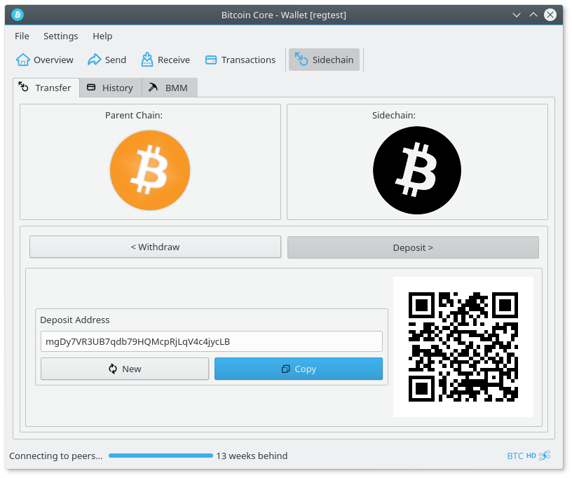
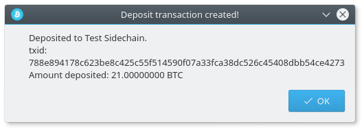
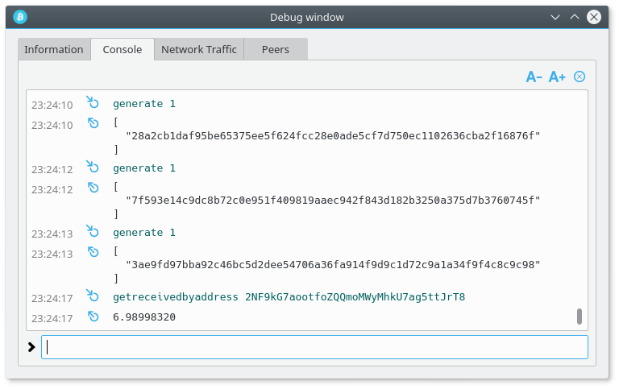

Testing Drivechains
===================

Setup
-----
- Create directories to store the mainchain and sidechain repositories
```
mkdir -p ~/drivechain/{mainchain,sidechain}
```

- Create directories for mainchain and sidechain datadir
```
mkdir -p ~/drivechain/data/{maindata,sidedata}
```

`Note: this guide will assume that you have created the same directories`

### Mainchain (bitcoin) setup
- Clone repository and checkout mainchain branch

`Note: Optionally keep a copy of the downloaded bitcoin/ repo to skip cloning again later`
```
cd ~/drivechain/mainchain/
git clone https://github.com/drivechain-project/bitcoin.git
cd bitcoin/
git checkout mainchainBMM
```

- Build
```
./autogen.sh
./configure
make
```

- Configuration file

Copy the main.conf configuration file from the [Drivechain testing repository](https://github.com/drivechain-project/testing)

to ~/drivechain/data/maindata/bitcoin.conf
`Note: Make sure you name the file bitcoin.conf`

### Sidechain setup
- Clone repository and checkout sidechain branch
```
cd ~/drivechain/sidechain/
git clone https://github.com/drivechain-project/bitcoin.git
cd bitcoin
git checkout sidechainBMM
```

- Build
```
./autogen.sh
./configure
make
```

- Configuration file

Copy the side.conf configuration file from the [Drivechain testing repository](https://github.com/drivechain-project/testing)

to ~/drivechain/sidedata/bitcoin.conf
`Note: Make sure you name the file bitcoin.conf`

Running unit tests
------------------
From the mainchain directory (~/drivechain/mainchain/)
run all of the Drivechain & Bitcoin unit tests:
```
make check
```

To individually run just the Drivechain unit tests:
```
src/test/test_bitcoin --log_level=all --run_test=sidechaindb_tests
src/test/test_bitcoin --log_level=all --run_test=transaction_criticaldata_tests
src/test/test_bitcoin --log_level=all --run_test=bmm_tests
```

Manual testing
--------------
### Get everything started
- Start mainchain (bitcoin)

```
~/drivechain/mainchain/bitcoin/src/qt/bitcoin-qt --datadir=/home/$(whoami)/drivechain/data/maindata/ &
```

- Start sidechain

```
~/drivechain/sidechain/bitcoin/src/qt/bitcoin-qt --datadir=/home/$(whoami)/drivechain/data/sidedata/ &
```

Both clients (sidechain & mainchain) should start in regtest mode, note the
blue icon. If not, you need to make sure you saved the configuration files
correctly and started the clients with the proper datadir specified.


- Mine 101 blocks on the mainchain to get coins

Open the debug window, switch to the console tab and enter:
```
generate 101
```

### Create deposit from mainchain to sidechain

- Deposit to sidechain

Go to the send page of the `mainchain` bitcoin-qt client, click send (sidechain)
which is located at the bottom of the page in the same row of buttons as the
normal Send button. The sidechain deposit dialog will pop up.

Get a deposit address from the sidechain tab of the `sidechain` bitcoin-qt.



Paste the sidechain deposit address into the deposit dialog open on the
`mainchain` client.

Enter the amount you wish to deposit. In this example we will send 7 BTC to the
sidechain.


Click the deposit button. Upon success the results will be displayed, or an
error message if there were issues.



Generate a block on `mainchain` to add the deposit to the DB.
```
generate 1
```

- Generate enough blocks on sidechain to clear the deposit

From the console tab of the `sidechain` debug window:
```
generate 101
```
You should see that 7 BTC have been deposited from the bitcoin mainchain into
the sidechain address that you specified.

### Withdraw from sidechain to mainchain

- Withdraw from sidechain

With the `sidechain` client open, visit the sidechain tab.

Click withdraw, enter the `mainchain` bitcoin address that you would like to
withdraw to and the amount to withdraw. In this example we will withdraw 3 BTC
from the sidechain and send it back home to bitcoin.


Click the withdraw button to broadcast it.

### Trigger WT^ creation, verification and payout

- Generate blocks on sidechain to create and broadcast WT^

`WT^ = grouped withdrawal transactions to be validated by mainchain`

- Generate enough blocks on the `sidechain` client to trigger the creation of
WT^, which will be broadcast automatically to the bitcoin mainchain. If you are
following along and made a deposit to SIDECHAIN_TEST then the WT^ creation will
be triggered every 300 blocks.

Example (if current block height = 150)
```
generate 150
```

Generate a block on the mainchchain to add the WT^ to the DB and start the
verification process
```
generate 1
```

- Finally, generate blocks on mainchain to trigger WT^ payout

Generate enough blocks on the mainchain to increment the workscore of WT^ up to
the minimum workscore for the sidechain. If everything worked out correctly you
will see your `sidechain` withdraw deposited into the `mainchain` bitcoin
address that you specified.

Example (SIDECHAIN_TEST minWorkScore = 100)
```
generate 100
```


If you received the 3 (~2.9 with fee removed) BTC withdrawal that you created
on the sidechain, everything worked. If not, feel free to open a github issue.

### If you encounter an error, start here:
Confirm the following:
- You have setup the configuration files as instructed
- You launched bitcoin-qt with the correct parameters 
- You have checked out the mainchain and sidechain branches in the correct directories

`The further you stray from this guide the more likely you are to experience
unknown bugs. Please experiment and report issues via github!`
